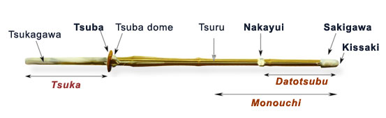

******************************************************
Suburi, Cutting
******************************************************
Video
========

.. _suburi-hayasuburiKendoWorld:

Tip of the Week - Hayasuburi 
---------------------------------------
.. raw:: html

	<iframe width="560" height="315" src="https://www.youtube.com/embed/0uH-sxz3n6E" frameborder="0" allowfullscreen></iframe>

	#. use the wrist to flip the shinai outer

	#. use the feet and hip properly

	#. thrown the hip into in as shown in 1:44

	#. move the hip as much as we can 

	#. your tare throw in front.

	#. Start at the upper swing as shown in 2:40

	#. make each cut count

	#. pause a while
	
Text
========

.. _suburi-sueno:

Sueno sensei and the 45 degree myth
---------------------------------------
	- https://kendoinfo.wordpress.com/2016/09/19/sueno-sensei-and-the-45-degree-myth/

#. Kendo training should be a step-by-step process, based on getting each stage right before you move on to the next.
	
#. To reach a good level of men suburi before attempting tobikomi (飛込み, means dive, jump, plunge) men

#. We should not bring them back to a point where he have to open our elbows, but that the swing should go back as far as it can while keeping the arms in correct cutting position.

#. Relax your arms immediately after striking men,  so that the shinai could bounce upwards, allowing your forward motion and following zanshin to continue smoothly.

#. There are many paths to the top of the mountain.

.. _suburi-bigSmall:

Big or Small?
---------------------------------------
	- https://kendoinfo.wordpress.com/2009/01/28/big-or-small/
	
#. Why do you tell me to cut big when you cut small?

#. tenouchi (the holding) is particularly relevant to making small waza (means techniques, skills) work

#. Kote is by definition a small technique

#. Nuki men (escrape from the opponent's attach and hit his men) is a great example of big technique. 

#. kensen  = "the tip of a sword or shinai" 

#. tobikomi = 飛込み ="dive, jump, plunge"

#. sutemi = 捨身 = "throw away the seed"

#. the cutting motion should be elliptical

#. suburi that "bringing the shinai back against your buttocks" is not the way to hit men.

#. The psychology is simple, people were relieved at having to do only 200, but as this was more than the standard set 20 or 30 they relaxed from the start, saving energy for the last few. 

**The following are from the comments.**

#. adding a rotation (slight) with the focus in the center of the tsuka, between your hands will increase the speed of the kensen by 30%.

#. a push/pull motion between the left and right hand is also an important part of delivering the strike quickly.

#. At my age I move slowly and see slowly, so when I see an attack it looks slow and I can beat it.

#. learn good debana (You can foresee the motion of your opponent hence you can hit him before he starts his attack.) timing and it does not matter how fast the other guy is.

#. to push the left hand forward and pull the right hand back as you raise the shinai and then push the right hand forward and pull the left hand back on the strike.

Timing of one
---------------------------------------
	- https://kendoinfo.wordpress.com/2016/03/07/timing-of-one/
	

#. the weight of the cut should be in the shinai’s monouchi and that we should aim for maximum extension using the shoulders, elbows, wrists and tenouchi in that order.

#. His view was that 45 degrees is the natural extension angle of the shoulder joint and that if we reach back beyond this point then we have to change our grip.

#. By keeping to the 45 degree rule we are able to lift the shinai and strike in the timing of one (ichibyoshi). If we go beyond that point, we follow a timing of two, as the movement is broken as we rearrange the positions of our fingers on the tsuka

**The following are from the comments.**

#. do a lots of suburi where the shinai comes right back to touch the body before going forward.

#. I still keep the pressure with my left little finger so that the kensen does not drop below the horizontal.

#. I actually prefer the more natural horizontal to strict 45.

#. Nothing new really. Only hard to master. And then practice is often a little different form theory.

推舉竹刀如舉杯飲水
-----------------------
	- https://www.facebook.com/180329075320617/photos/a.180727351947456.39311.180329075320617/1269813319705515/?type=3&theater
